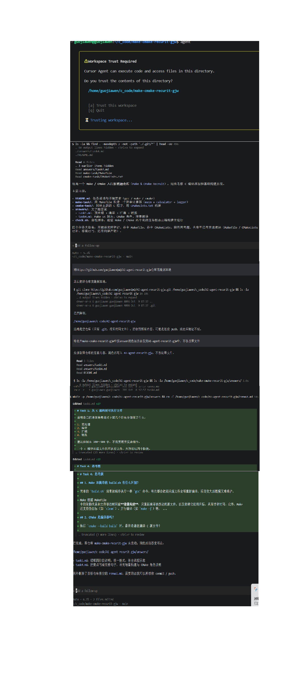

## 任务一

1. 使用coursor agent
2. 安装
方法1：在WSL Ubuntu终端执行一键安装，输入curl htttps://cursor.com/install -fsS|bash
到WSL终端,等待跑完，之后终端cursor就可以启动：
方法2：Windows浏览器直接下载安装包
打开浏览器访问官网：https://cursor.com/downloads
选择 Windows 版本，下载 .exe 安装包，直接在Windows安装。
3. 任务+修改
简要概括仓库内容，复制一个仓库地址，润色answer

4. git diff可看到暂存区改动，绿色新增，红色删除,与原仓库对比记录每一次删改
